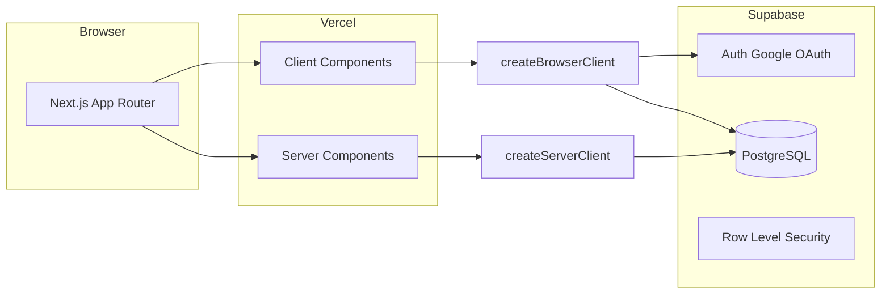

# AI Tool Feed Platform (MVP) — Implementation Plan

## Current state vs target

| Today | Target |
|--------|--------|
| [ai-community-lab-frontend/](ai-community-lab-frontend/) Angular 21 | Next.js App Router + Tailwind + Lucide |
| [ai-community-lab-backend/](ai-community-lab-backend/) ASP.NET + EF + Postgres | **Removed** for MVP; data + auth on **Supabase** |
| [docker-compose.yml](docker-compose.yml) db + api + nginx web | Optional: **Next-only** compose + external Supabase |

You chose **full replace** of Angular/.NET and **Vercel** for hosting.

---

## 1. Repository layout

- **Replace** [ai-community-lab-frontend/](ai-community-lab-frontend/) with a new **Next.js** project (same folder name keeps existing docs/CI paths predictable; alternatively rename folder to `web/` and update root README only — pick one during implementation, default: **reuse `ai-community-lab-frontend` as the Next app root**).
- **Remove** the [.NET backend](ai-community-lab-backend/) tree (or leave a short `README.md` stub: “Superseded by Supabase — removed in &lt;commit&gt;” if you prefer traceability in git history).
- **Update** root [README.md](README.md), [DOCKER.md](DOCKER.md) (if present), and [docker-compose.yml](docker-compose.yml) to describe Supabase + optional Next Docker only — no local Postgres/API services for the main flow.

---

## 2. Supabase project (dashboard + SQL in repo)

**Manual (Supabase UI):**

- Create project; enable **Google** provider under Authentication → Providers (OAuth client IDs from Google Cloud Console: authorized redirect URIs must include Supabase callback URL).
- Note `NEXT_PUBLIC_SUPABASE_URL` and `NEXT_PUBLIC_SUPABASE_ANON_KEY` for Vercel and local `.env.local`.

**Versioned SQL** (e.g. `supabase/migrations/001_initial.sql` or `database/supabase_schema.sql` at repo root):

- Tables as specified:
  - `posts`: `id uuid pk`, `title`, `url`, `description`, `category`, `votes_count int default 0`, `created_at timestamptz default now()`, optional `user_id uuid` references `auth.users(id)` for ownership/display (recommended for “who submitted” later; not in your minimal list but useful for moderation — **optional** for MVP).
  - `comments`: `id`, `post_id` → `posts`, `user_id` → `auth.users`, `content`, `created_at`.
  - `votes`: `id`, `post_id`, `user_id`, **`unique (user_id, post_id)`**.
- **Indexes** (as you specified): `posts(created_at desc)`, `votes(post_id)`, `comments(post_id)`.
- **`votes_count` integrity**: Add **triggers** on `votes` `INSERT`/`DELETE` to increment/decrement `posts.votes_count` so counts stay correct under concurrency and you never rely on client-only math. Alternatively use a single RPC transaction for “toggle vote” — triggers are simpler for “always consistent.”

**Row Level Security (RLS)** — required for production Supabase:

- `posts`: `SELECT` for `anon` + `authenticated` (public feed). `INSERT` only `authenticated`. `UPDATE`/`DELETE` only if you add ownership columns and policies (MVP: `INSERT` only, no edit).
- `comments`: `SELECT` public; `INSERT` `authenticated`.
- `votes`: `SELECT` for own rows or aggregate reads via posts; `INSERT`/`DELETE` `authenticated` with `user_id = auth.uid()`.

Enable RLS on all three tables and test with anon key from the app.

---

## 3. Next.js application structure

**Tooling:** TypeScript, Tailwind CSS, Lucide React, `@supabase/supabase-js` + `@supabase/ssr`.

**Supabase clients** (your spec names `.js`; use **TypeScript** in Next: equivalent files):

- `lib/supabase/client.ts` — `createBrowserClient` for client components.
- `lib/supabase/server.ts` — `createServerClient` for Server Components / Route Handlers / Server Actions.
- `middleware.ts` — refresh Supabase session cookies (official `@supabase/ssr` pattern) so server and client stay in sync.

**Routes (App Router):**

| Route | Role |
|-------|------|
| `app/page.tsx` | Home: feed + sort **New** (`created_at desc`) / **Top** (`votes_count desc`) |
| `app/submit/page.tsx` | Submit tool form (protected: redirect or gate if not logged in) |
| `app/post/[id]/page.tsx` | Post detail + comments + add comment |

**Layout:**

- Root `app/layout.tsx`: dark theme defaults (`bg-[#0f0f0f]`, text colors), sticky top navbar, font.
- Shared shell: **3-column grid** — left sidebar (fixed width), center scroll, right panel; responsive: collapse sidebars to drawer/bottom nav on small screens (minimal breakpoint behavior so MVP is usable on mobile).

**Design tokens (Tailwind):** map to your palette — background `#0f0f0f`, cards `#1a1a1a`, accent `#00ff9f`. Hover on cards (border/translate/shadow subtle). **Floating “+ Submit Tool”** fixed bottom-right on main routes.

**Core UI components:**

- `Sidebar`: Home, Trending, New, Categories (static links or query-param filters), primary Submit CTA.
- `ToolCard`: left upvote control, title, one-line description, category tag(s), “Visit →” external link, meta (comment count, relative time).
- `RightPanel`: trending list (reuse same query as `/` Top with small `limit`), Login CTA, Submit CTA.
- Empty state copy exactly: `No tools yet 😢 Be the first to share something cool`

**Server vs client:**

- **Server Components** for initial feed and post detail data fetching (fast TTFB, SEO-friendly).
- **Client Components** for: vote button (optimistic UI), comment form, auth buttons, sort toggle, mobile menu.

---

## 4. Auth and gated actions

- Use Supabase Auth session from middleware + client.
- **Google OAuth:** `signInWithOAuth({ provider: 'google' })` from a header/sidebar button; callback route handled by Supabase + middleware cookie refresh.
- Block **post / vote / comment** when `!user`: disable UI + guard Server Actions / Route Handlers returning 401.

---

## 5. Core behaviors

**Posting:** Server Action or `POST` Route Handler inserting into `posts` with `user_id` if column exists; validate **minimum title length** (e.g. 3–5 chars) and URL format on server.

**Voting:** Client sends insert/delete on `votes` (or call an RPC that toggles vote). **Optimistic UI:** update local state immediately, rollback on error + **toast**. Triggers keep `votes_count` in sync.

**Comments:** List by `post_id`; insert with `user_id`; show count on card via `count` query or denormalized column (simplest: `count(*)` in feed query with a join/subquery or separate aggregate — for MVP, **subquery or RPC** to avoid N+1).

**Anti-spam (basic):** Login required + server-side validation. **Optional** rate limit “1 post / 10s per user”: PostgreSQL function checking `max(created_at)` for `user_id` in `posts`, or Edge Middleware with KV later — document as **phase 2** if you want to ship faster.

---

## 6. UX polish

- **Skeleton** components for feed and post detail loading states (`loading.tsx` where appropriate).
- **Toasts:** `sonner` or `react-hot-toast` (one dependency).
- **Errors:** try/catch in actions; toast on failure; don’t silent-fail votes.

---

## 7. Vercel

- Connect repo; set environment variables `NEXT_PUBLIC_SUPABASE_URL`, `NEXT_PUBLIC_SUPABASE_ANON_KEY`.
- Framework preset Next.js; Node 20+.
- Add Supabase production URL to **Google OAuth** authorized redirect URIs (both Supabase and Google Cloud).

---

## 8. Optional Docker (your §12)

- **Multi-stage Dockerfile** in the Next app folder: `next build` → `node` runner with `standalone` output (Next `output: 'standalone'` in `next.config`).
- **docker-compose.yml** at repo root: single `app` service, `env_file: .env.example`; document that Supabase is external.
- **`.env.example`:** `NEXT_PUBLIC_SUPABASE_URL=`, `NEXT_PUBLIC_SUPABASE_ANON_KEY=`.

---

## 9. What gets deleted or retired

- Angular app, .NET API, EF models, and **local-only** Postgres bootstrap in compose for the **default** dev story — replaced by Supabase cloud (local Supabase CLI is optional for advanced devs).
- Update any Netlify-specific config under the old frontend; Vercel becomes primary ([netlify.toml](ai-community-lab-frontend/netlify.toml) removed or replaced with `vercel.json` only if needed).

---

## 10. Implementation order (suggested)

1. Supabase SQL + RLS + triggers (test in SQL editor).
2. Scaffold Next.js + Tailwind + theme + shell layout (3-column + navbar + FAB).
3. `lib/supabase` clients + `middleware.ts` + Google sign-in flow.
4. Home feed (RSC) + `ToolCard` + empty state + sorting.
5. Submit page + Server Action + validation.
6. Post detail + comments + vote (client optimistic + toasts).
7. Right panel trending + polish (skeletons, errors).
8. Optional Docker + final README; remove legacy stacks.

---

## Risks / notes

- **Unique vote constraint** must pair with UX: either “vote” only (no downvote) or toggle by delete — define one flow in UI.
- **Comment count on cards:** use a single efficient query pattern (view or aggregated select) to avoid per-card round trips.
- **`votes_count`:** must be maintained by trigger or transactional RPC to satisfy “increment” and stay correct under RLS.

This plan stays within **simplicity / speed / usability** and avoids overbuilding (no Redis, no custom .NET layer for MVP).
